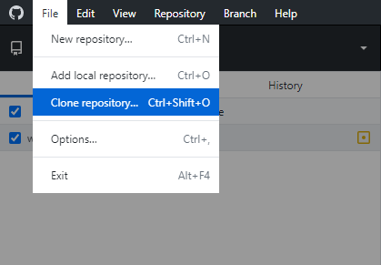
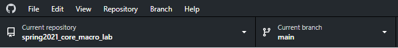
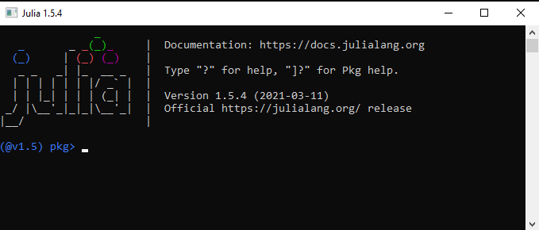
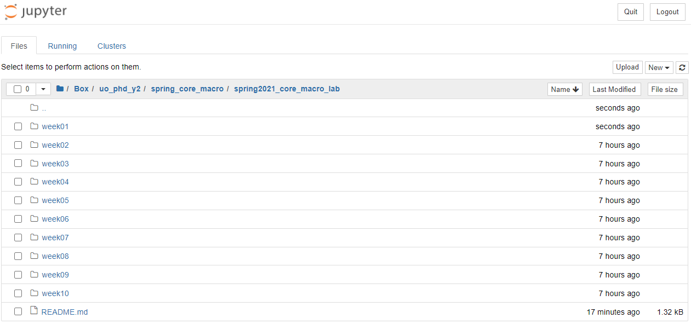
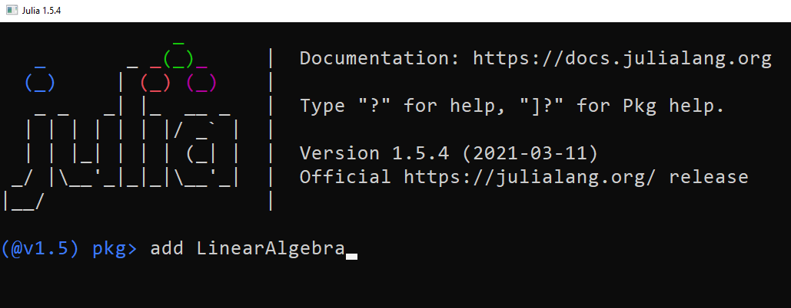

# Introduction to Julia

Contents:

- [Introduction to Julia](#Introduction-to-Julia)  
  - [GitHub](#GitHub)  
  - [Work Environment](#Work-Environment)  
  - [Jupyter Basics](#Jupyter-Basics)  
  - [Julia Basics](#Julia-Basics)   


In this lab we will: 

(1) Load the lab GitHub repository locally;

(2) Set up our work environment by installing Julia and Jupyter; 

(3) Cover Jupyter basics; 

(4) Go over some Julia basics.

The goal is to set up a stable work environment for the rest of the quarter while getting a taste of the Julia language.

Today's material borrows quite a lot from [Quantitative Economics with Julia by QuantEcon](https://julia.quantecon.org/), so I encourage everyone to check it out for more details.

---
## GitHub

As you might have already noticed, all lab materials for this quarter live on GitHub. I've done so to allow for easy version control and replicability.

Here I will guide you through the bare minimum of the necessary GitHub functionality required to maintain up-to-date access to lab materials. 

Go to the [GitHub website](https://github.com/) to create an account and register for a [student/educator discount](https://education.github.com/pack/offers) (this last part isn't necessary, but can't hurt).

After finishing the above step, download and install [GitHub Desktop](https://desktop.github.com/). Open it and log into your GitHub account locally.

In the GitHub Desktop interface, go to `File > Clone Repository`:



The following box should pop up, in which we need to navigate to the `URL` tab:


Paste `https://github.com/gionikola/spring2021_core_macro_lab.git` into the URL, and then choose a folder in which you would like to keep the lab materials.

Once this is done, make sure that the `Current repository` is set to `spring2021_core_macro_lab`:



Now we can automatically keep all lab documents up-to-date by periodically opening up GitHub Desktop and going to `Repository > Pull`:


---
## Work Environment

To set up the necessary work environment for these labs, we need to do the following three things:

- Download and install Julia;
- Download and install Jupyter;
- "Connect" Jupyter with Julia.

We will first need to download and install the current stable version of Julia by visiting [this page](https://julialang.org/downloads/) and following the instructions for the appropriate operating system. 

Then we will need to visit [this page](https://www.anaconda.com/products/individual) to download and install Anaconda, which essentially a package management tool that includes Jupyter. To learn more about Anaconda, read the [Wikipedia page](https://en.wikipedia.org/wiki/Anaconda_(Python_distribution)). 

Once both Julia and Anaconda are installed, we can perform the final step of linking Jupyter with Julia. Open Julia -- we should see the following window pop up:


This is the Julia REPL (Read-Evaluate-Print Loop). 

Now type `]` to enter package mode, then type `add IJulia`.



We then click `Enter` on the keyboard to run the command. This will install the IJulia kernel, which should automatically link Julia with Jupyter. After the installation is complete, we click `Backspace` on the keyboard to leave package mode.

We can now type `using IJulia; notebook()` into the REPL to launch Jupyter Notebook. If this running this command leads to an error or the prompt `install Jupyter via Conda, y/n? [y]:`, then we can alternatively launch Jupyter Notebook by finding where it lives on our machine and/or typing `jupyter notebook` into the Anaconda Prompt. In any case, we should see something similar to the following tab open in our web browser (but in a different directory):



We can now manually navigate to our preferred directory (folder) and create new notebooks, along with other types of documents. When we open a document, it will open as a new tab in our web browser.

At this point we are all set-up and ready to code!

---
## Jupyter Basics

The keyboard shortcuts window says it best: "The Jupyter Notebook has two different keyboard input modes. Edit mode allows you to type code or text into a cell and is indicated by a green cell border. Command mode binds the keyboard to notebook level commands and is indicated by a grey cell border with a blue left margin."

At any given point in time in the Jupyter interface we are either in edit mode or command mode. We can tell which mode we are in using two indicators: (1) the color of the outline around a selected cell, and (2) the presence/absence of a pencil symbol next to the active kernel name at the upper-right corner of the notebook.

If we are in edit mode, then we should see the following:


Otherwise we should see the following:


The following is a list of some very useful shortcuts:

- `Esc` triggers command mode if currently in edit mode;
- `Enter` triggers edit mode if currently in command mode;
- `Ctrl-Enter` runs selected cell;
- `Shift-Enter` runs selected cell and selects the next cell below;
- `Alt-Enter` runs selected cell and creates a new cell below;
- `D, D` deletes selected cell.

Check out more shortcuts by going into command mode and clicking the `H` key.

There are three types of cells (1) code, (2) Markdown, and (3) raw. We will mostly be interested in code and Markdown cells, so we disregard the final category. We can tell what type of cell we are dealing with by either (1) looking up at our toolbar 


or by (2) looking to the left of the cell to check whether there is a `In [ ]:` present -- if so, then we have ourselves a code cell, otherwise it is a Markdown cell.

A couple more useful shortcuts:

- `M` changes a selected cell type to Markdown if in command mode;
- `Y` changes a selected cell type to code if in command mode.

Jupyter is simple and intuitive enough that the above should be enough to get us going.

---
## Julia Basics

### Packages

Let us start by loading Julia packages.


```julia
using LinearAlgebra # Load LinearAlgebra package
using Statistics # Load Statistics package
```

Suppose we do not have the `LinearAlgebra` package available in our environment. 

In this case, loading LinearAlgebra with `using` will not work, since we first need to install the package using the following code: 


```julia
using Pkg # Load `Pkg`, which can be used to install packages
Pkg.add("LinearAlgebra") # Install `LinearAlgebra` package
```

      Resolving package versions...
    No Changes to `C:\Users\gioni\Project.toml`
    No Changes to `C:\Users\gioni\Manifest.toml`
    

We could have alternatively opened the REPL, entered package mode by clicking `]`, and ran `add LinearAlgebra`.




### Simple Data Types

Now that basic package management is out of the way, we can start talking about data types.

Suppose we have randomly-generated variables $x$ and $y$, and would like to check whether $x > y$. Let's call this condition A. We can store the status of condition A as a Boolean variable $z$. 


```julia
x = randn() # Generate random value `x`
y = randn() # Generate random value `y`
z = x > y   # Store status of condition A as variable `z`
message = "x = $(x) and y = $(y), " * "therefore condition A is $(z)."
message
```


    "x = -0.41855672790727266 and y = 0.20941356839377148, therefore condition A is false."


Notice that we used the `randn()` function to generate a random $x,y \in \mathbb{R}$. 
Furthermore, we generated a string called `message` by concatenating two separate strings using `*`.
We print the values of variable `x`, `y`, and `z` in `message` using `$`.  

Let's confirm that `message` is indeed a string:


```julia
typeof(message)
```


    String


Let's also check the data type of `x` (and equivalently `y`):


```julia
typeof(x)
```


    Float64


Now let's check the data type of `z`:


```julia
typeof(z)
```


    Bool


So far we've seen strings, floats, and booleans, but we also have integers:


```julia
y = 5
typeof(y)
```


    Int64


Since we have a float `x` and an integer `y`, let's test out some basic arithmetic operations with them:


```julia
@show x + y
@show x - y
@show x * y
@show x / y
@show x - (-y)
@show 3x - 4y
@show x^(-1);
```

    x + y = 4.581443272092727
    x - y = -5.418556727907273
    x * y = -2.0927836395363633
    x / y = -0.08371134558145453
    x - -y = 4.581443272092727
    3x - 4y = -21.25567018372182
    x ^ -1 = -2.3891624081635614
    

Notice that we used the `@show` macro the print out equations.
Furthermore, we ended the last line of the cell with a `;` to supress the redundant printing of the output of `x^(-1)`. 
See what happens when you construct a similar cell without `;` at the end.

But did you know we can also apply arithmetic operations to booleans?


```julia
z1 = true # define a true boolean 
z2 = false # define a false boolean
@show z1 + 0
@show z2 + 0
@show z1 + z2 
@show x + z1
@show x * z1;
```

    z1 + 0 = 1
    z2 + 0 = 0
    z1 + z2 = 1
    x + z1 = 0.5814432720927274
    x * z1 = -0.41855672790727266
    

Let's give `x` and `y` imaginary components, and play around with the resulting imaginary numbers.


```julia
@show x = x + 3im
@show y = y + 2im
@show x + y
@show x - y
@show x * y
@show x / y
@show x - (-y)
@show 3x - 4y
@show x^(-1);
```

    x = x + 3im = -0.41855672790727266 + 9.0im
    y = y + 2im = 5 + 6im
    x + y = 4.581443272092727 + 15.0im
    x - y = -5.418556727907273 + 3.0im
    x * y = -56.092783639536364 + 42.48865963255636im
    x / y = 0.8509379731223545 + 0.7788744322531742im
    x - -y = 4.581443272092727 + 15.0im
    3x - 4y = -21.25567018372182 + 3.0im
    x ^ -1 = -0.005156214962679721 - 0.1108713146152038im
    

### Introduction to Arrays

We can also collect data into arrays.


```julia
a = [10, 20, 30]
```


    3-element Array{Int64,1}:
     10
     20
     30


The output here tells us that `a` is a one-dimensional array containing `Int64` data. 


```julia
b = [1.0, 2.0, 3.0]
```


    3-element Array{Float64,1}:
     1.0
     2.0
     3.0


`b` seems to have the same dimensions as `a`, but it contains `Float64` data instead of integer data.

Suppose we try to include multiple data types in a single array:


```julia
c = [1, 1.0, true, "text"]
```


    4-element Array{Any,1}:
        1
        1.0
     true
         "text"


This is undesirable, but as we can see -- it works.

Let's check out the dimensions and size of array/vector `b`:


```julia
@show ndims(b) # Show dimensions of vector `b`
@show size(b); # Show size of vector `b`
```

    ndims(b) = 1
    size(b) = (3,)
    

The above output essentially tells us that `b` is a vector with 3 entries. 

I say that `b` is a vector since a one-dimensional array is equivalent to a vector, while a two-dimensional array is equivalent to a matrix. 

We confirm this in the following cell:


```julia
@show Array{Float64, 1} == Vector{Float64}
@show Array{Float64, 2} == Matrix{Float64};
```

    Array{Float64, 1} == Vector{Float64} = true
    Array{Float64, 2} == Matrix{Float64} = true
    

There are two different ways we can create a column vector:


```julia
col1 = [1, 2, 3]
col2 = [1; 2; 3]
col1 == col2 # Test if both are column vectors
```


    true


We can also create row vectors in the following manner:


```julia
row1 = [1 2 3]
```


    1×3 Array{Int64,2}:
     1  2  3


Let's check the dimensions and size of the row vector `row1`:


```julia
@show ndims(row1)
@show size(row1);
```

    ndims(row1) = 2
    size(row1) = (1, 3)
    

According to the above output, row vectors are 2-dimensional -- in other words, they are matrices.

Furthermore, unlike column vectors, row vectors are not flat. The above output shows that `row1` has one row and three columns.

Let's create a more traditional-looking matrix `A`:


```julia
A = [1 2; 3 4]
```


    2×2 Array{Int64,2}:
     1  2
     3  4


Now let's transpose `A`:


```julia
A'
```


    2×2 LinearAlgebra.Adjoint{Int64,Array{Int64,2}}:
     1  3
     2  4


We can access the second column of `A` in the following manner:


```julia
A[:,2]
```


    2-element Array{Int64,1}:
     2
     4


Analogously, we may access the second row of `A` in the following manner:


```julia
A[2,:]
```


    2-element Array{Int64,1}:
     3
     4


Notice that when we accessed the second row of `A`, the output was a flat array (column vector).

To may simply transpose it to obtain it in row vector form:


```julia
A[2,:]'
```


    1×2 LinearAlgebra.Adjoint{Int64,Array{Int64,1}}:
     3  4


What if we want to access the $(2,2)$ entry of `A`?


```julia
A'[2,2]
```


    4


Now let's talk briefly about array creation.

A nice way of creating zero vectors is using the `zeros()` function:


```julia
zeros(2)
```


    2-element Array{Float64,1}:
     0.0
     0.0


Similarly, we can use `zeros()` to create matrices:


```julia
zeros(2,2)
```


    2×2 Array{Float64,2}:
     0.0  0.0
     0.0  0.0


More generally, we may use the `fill()` function to create arrays with customized uniform entries:


```julia
fill(3, 2, 4)
```


    2×4 Array{Int64,2}:
     3  3  3  3
     3  3  3  3


How do we copy an array? Let's try simply using an equality:


```julia
x = fill(1, 3) # create vector `x`
y = x # bind `y` to vector `x`
y[2] = 0 # change second entry of `y` to zero
x
```


    3-element Array{Int64,1}:
     1
     0
     1


What we did in the above cell is create a vector `x`, bind a new variable `y` to `x`, and then change the second entry of `y`. 

We would expect this to alter `y` and not `x`, but it turns out this is not the case!

So we can't quite "copy" arrays using a simple equality. Instead we may use the `copy()` function:


```julia
x = fill(1, 3)
y = copy(x) 
y[2] = 0
x
```


    3-element Array{Int64,1}:
     1
     1
     1


Notice that `x` didn't change, as desired.

What if we don't want to copy an array exactly, but instead create an array of the same data type and size?

For this we can use the `similar()` function:


```julia
x = fill(1, 3)
y = similar(x)
y
```


    3-element Array{Int64,1}:
     241270592
     145391712
     145395680


We may also use `similar()` to change the size while keeping the same data type:


```julia
x = fill(1, 3)
y = similar(x, 4)
y 
```


    4-element Array{Int64,1}:
             2
             1
     145359361
     387677600


We may also create a matrix similar to a vector:


```julia
x = fill(1, 3)
y = similar(x, 2, 2)
y
```


    2×2 Array{Int64,2}:
     232385536  145391776
     387794336  379442896


### Array Operations

Let's create a random vector and then check out some of its properties:


```julia
v = [-1, 0, 1] # create vector `v` w/ 100 draws from N(0,1) distribution

@show length(v)
@show sum(v)
@show mean(v)
@show std(v)
@show var(v)
@show maximum(v)
@show minimum(v)
@show extrema(v);
```

    length(v) = 3
    sum(v) = 0
    mean(v) = 0.0
    std(v) = 1.0
    var(v) = 1.0
    maximum(v) = 1
    minimum(v) = -1
    extrema(v) = (-1, 1)
    

We can sort the values in vector `v`:


```julia
w = sort(v, rev = true)
```


    3-element Array{Int64,1}:
      1
      0
     -1


The way in which we sorted vector `v` above does not modify `v` itself. 

We can, however, also modify the original vector using the `sort()` function:


```julia
w = sort!(v, rev = true) 
v == w
```


    true


Notice that in the above cell we tested whether vectors `w` and `v` have the same values, and found that they do! This means that the original vector `v` was successfully modified.

How to do matrix multiplication?


```julia
A = [1 2; 2 1]
B = ones(2,2)
c = [1, 3]

@show A*B
@show A*B'
@show A*c 
@show c'*A;
```

    A * B = [3.0 3.0; 3.0 3.0]
    A * B' = [3.0 3.0; 3.0 3.0]
    A * c = [7, 5]
    c' * A = [7 5]
    

Let's solve $A \, x = c$:


```julia
x1 = A \ c # the best approach
x2 = inv(A) * c # alternative
x1 ≈ x2
```


    true


In the above cell I show two equivalent ways of solving for $x$.

I check their equivalence by testing whether `x1` is approximately equal to `x2` using the $\approx$ operator.

You may write $\approx$ in a code cell by typing "\approx" ($\LaTeX$ syntax) and hitting 'Tab' on your keyboard. 

In fact, you can write many other characters this way:


```julia
α = 1 # \alpha + Tab
β = 2 # \beta + Tab
γ = α + β # \gamma + Tab
γ
```


    3


We can also easily do elementwise operations. 

For example, suppose we would like add 1 to every element of a vector or a matrix.

To do so, we **broadcast** the addition (`+`) operator by also including a period (`.+`):


```julia
A = ones(2,2)
x = ones(2) 
@show A .+ 1
@show x .+ 1;
```

    A .+ 1 = [2.0 2.0; 2.0 2.0]
    x .+ 1 = [2.0, 2.0]
    

Similarly, we can squared every entry of a vector/matrix:


```julia
@show (A .+ 1).^2
@show (x .+ 1).^2
```

    (A .+ 1) .^ 2 = [4.0 4.0; 4.0 4.0]
    (x .+ 1) .^ 2 = [4.0, 4.0]
    


    2-element Array{Float64,1}:
     4.0
     4.0


In fact, we can broadcast pretty much any function. Here's another example:


```julia
@show log.(A .+ 1)
@show log.(x .+ 1)
```

    log.(A .+ 1) = [0.6931471805599453 0.6931471805599453; 0.6931471805599453 0.6931471805599453]
    log.(x .+ 1) = [0.6931471805599453, 0.6931471805599453]
    


    2-element Array{Float64,1}:
     0.6931471805599453
     0.6931471805599453


Broadcasting is a very handy tool that you should end up using a lot to write efficient code.

Lastly, some basic linear algebra tools:


```julia
A = [1 2; 2 1]
```


    2×2 Array{Int64,2}:
     1  2
     2  1


```julia
det(A)
```


    -3.0


```julia
tr(A)
```


    2


```julia
eigvals(A)
```


    2-element Array{Float64,1}:
     -1.0
      3.0


```julia
rank(A)
```


    2


### Tuples

Tuples are essentially **immutable** data containers.

Let's create one:


```julia
tup = ("macro", 3.0, 2021)
```


    ("macro", 3.0, 2021)


Now let's try to change the second entry of `tup` to `1.0` (something that we often do with arrays):


```julia
tup[2] = 2.0
```


    MethodError: no method matching setindex!(::Tuple{String,Float64,Int64}, ::Float64, ::Int64)

    

    Stacktrace:

     [1] top-level scope at In[77]:1

     [2] include_string(::Function, ::Module, ::String, ::String) at .\loading.jl:1091


We obtained an error precisely because of the **immutability** of tuples -- once we define a tuple, we cannot change its entry values.

Let's try to store tuple entries as distinct variables:


```julia
class, quarter, year = tup
"Year: $year, Quarter: $quarter, Class: $class"
```


    "Year: 2021, Quarter: 3.0, Class: macro"


We may also create **named tuples** and merge them:


```julia
tup3 = (q1 = "Fall", )
tup4 = (q2 = "Winter", q3 = "Spring")
tup5 = merge(tup3, tup4)
```


    (q1 = "Fall", q2 = "Winter", q3 = "Spring")


Notice that to define a tuple with only one entry, we still need to include a comma with nothing to its right in the declaration.
